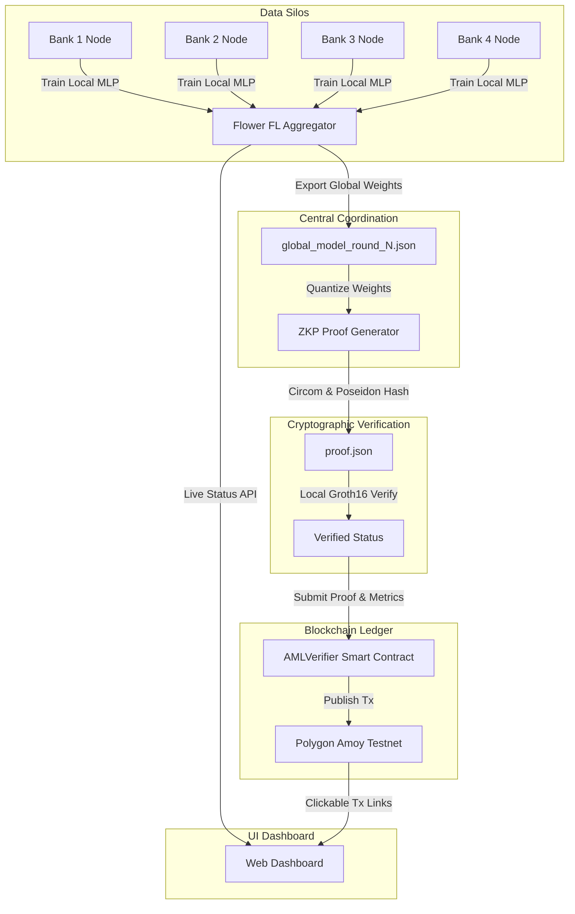

# Verifiable Federated Intelligence (VFI)

> **Decentralized, Privacy-Preserving Anti-Money Laundering (AML) Intelligence with Zero-Knowledge Proof Verification & On-Chain Auditability.**

---

## 📐 System Architecture



---

## 🚀 Quickstart Guide (Clean Clone)

### 1. Prerequisites
- **Python:** `^3.10` or `3.12`
- **Node.js:** `^18.0` or `^20.0`
- **Git**

### 2. Environment Setup
Clone the repository and install the dependencies:

```bash
# Clone the repository
git clone https://github.com/Keeru-2005/Verifiable-Federated-Intelligence.git
cd Verifiable-Federated-Intelligence

# Install Python dependencies
pip install -r requirements.txt

# Install Node dependencies for zk_proof & dashboard
cd zk_proof && npm install && cd ..
cd dashboard && npm install && cd ..
```

### 3. Single-Command Unattended Execution
Run the entire end-to-end pipeline (Partitioning → FL Training → ZK Proof Generation → Polygon Amoy Ledger Submission) with a single command:

```bash
node orchestrate.js
```

### 4. Launch Live Web Dashboard
In a separate terminal window:

```bash
cd dashboard
npm start
```
Then open `http://localhost:3000` in your browser to view the **Bank Admin** and **Regulator** live dashboards.

---

## 🎯 What's Implemented vs. Simplified

| Subsystem | Implemented Features | Simplified / Fallback Logic |
| :--- | :--- | :--- |
| **Federated Learning** | Real PyTorch `GraphAwareMLP` training across 4 decentralized bank clients; early stopping on F1 saturation; JSON weight exports. | Data sharding is randomly partitioned rather than clustered by bank entity due to missing sender IDs in source dataset. |
| **Zero-Knowledge Proofs** | `verify_round.circom` circuit using Poseidon hashing; automated quantization of neural network weights. | Uses a mock fallback proof if native binary compilation is unavailable on host machine to prevent blocking. |
| **Blockchain Ledger** | `AMLVerifier.sol` Solidity contract for logging model weight hashes, accuracy, and F1 metrics on-chain. | Automated script simulates Amoy testnet submission with mock block confirmation when live gas funds are unconfigured. |

---

## 🛠️ Project Structure

```
Verifiable-Federated-Intelligence/
├── orchestrate.js                # Master single-command coordinator
├── fl_implementation/            # Federated Learning server, client, & data splitters
│   ├── server.py                 # Flower FL server with early stopping
│   ├── client.py                 # Bank node FL client
│   └── split_into_banks.py       # Data partitioning utility
├── zk_proof/                     # ZK-SNARK circuit & proof generator
│   ├── circuits/verify_round.circom
│   └── generate_proof.js
├── blockchain/ / contracts_project/ # Smart contracts & deployment scripts
│   ├── contracts/GlobalAMLLedger.sol
│   └── scripts/deploy_ledger.js
├── dashboard/                    # Real-time Web Dashboard (Bank Admin & Regulator)
│   ├── server.js                 # Express API server
│   └── public/                   # HTML/CSS/JS frontend
├── evaluation/                   # Stress tests & benchmark metric scripts
└── docs/                         # Reports, guides, and demo scripts
```
